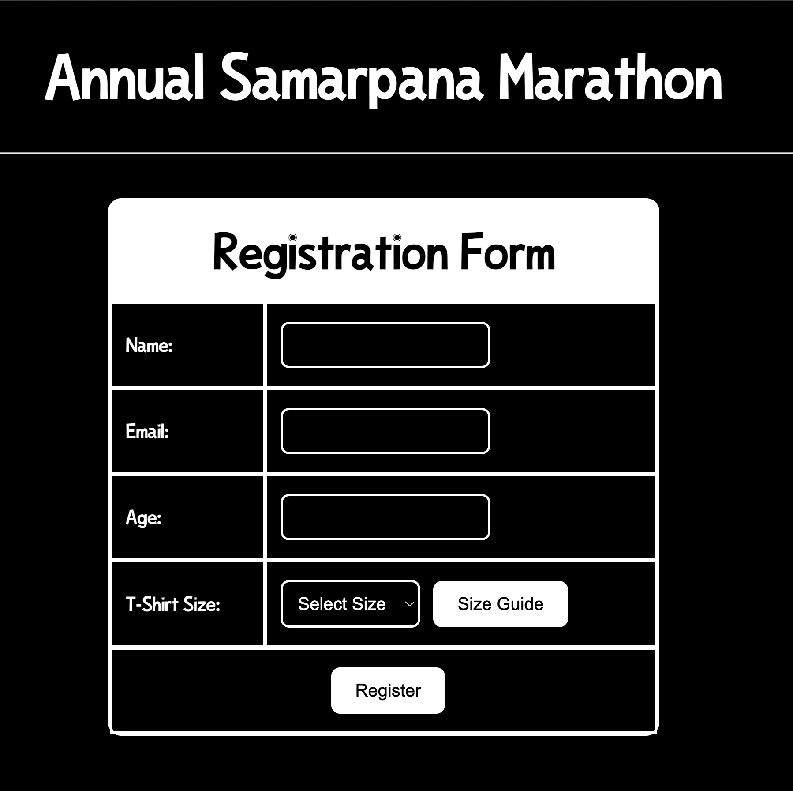
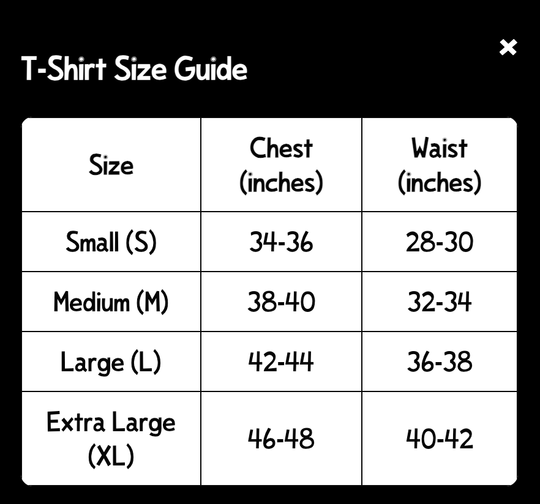

---

| Name          | SRN             | Section |
|---------------|-----------------|---------|
| Sabique Islam | PES2UG24CS421   | G       |
|         | DATE : 10/09/2025           | Unit 1 Assignment       |
|         |         |       |

---

# PROBLEM STATEMENT (for odd number SRNs)

 During the annual Samarpana Marathon, organized in honor of the army, participants are required to register through an online form. However, existing registration forms often lack proper interactivity, real-time input validation, and a responsive design, leading to incomplete entries, errors, and reduced user satisfaction. For this marathon, it is also mandatory for every participant to select a T-shirt size, as wearing the official Samarpana T-shirt is compulsory for the run. The form must not only validate user inputs but also provide dynamic feedback, ensure mobile-friendly responsiveness, and display a reference table of available T-shirt sizes for clarity. 
 
 If any required field is empty, an alert must show up asking to fill the required empty field. Display the date and time while the form is being filled for user convenience. 
 
 **HTML5 (Structure of the form), CSS(Responsive and visually appealing design), JavaScript (Dynamic interactivity and validation), Form Validation Techniques , User Interface (UI) & User Experience (UX) Design, Responsive Web Design.**

---

# Solution





### index.html

```
<!DOCTYPE html>
<html lang="en">
  <head>
    <meta charset="UTF-8" />
    <meta name="viewport" content="width=device-width, initial-scale=1.0" />
    <title>Annual Samarpana Marathon</title>
    <link rel="stylesheet" href="./static/styles.css" />
    <link rel="icon" href="./static/icon.svg" type="image/svg+xml" />
  </head>

  <body>
    <h1 class="header">Annual Samarpana Marathon</h1>
    <hr />

    <form action="/submit.php" method="POST" class="form-table">
      <table class="registration-table">
        <tr>
          <td colspan="2" class="registration-title">Registration Form</td>
        </tr>
        <tr>
          <td><label for="name">Name:</label></td>
          <td><input type="text" id="name" name="name" /></td>
        </tr>
        <tr>
          <td><label for="email">Email:</label></td>
          <td><input type="email" id="email" name="email" /></td>
        </tr>
        <tr>
          <td><label for="age">Age:</label></td>
          <td><input type="number" id="age" name="age" /></td>
        </tr>
        <tr>
          <td><label for="tshirt-size">T-Shirt Size:</label></td>
          <td>
            <select id="tshirt-size" name="tshirt-size">
              <option value="">Select Size</option>
              <option value="S">Small</option>
              <option value="M">Medium</option>
              <option value="L">Large</option>
              <option value="XL">Extra Large</option>
            </select>
            <button type="button" id="size-guide-btn">Size Guide</button>
          </td>
        </tr>
        <tr>
          <td colspan="2" style="text-align:center;">
            <button class="Button" type="submit">Register</button>
          </td>
        </tr>
      </table>
      <div id="size-guide-modal" class="modal">
        <div class="modal-content">
          <span class="close">&times;</span>
          <h3>T-Shirt Size Guide</h3>
          <table class="size-guide-table">
            <thead>
              <tr class="size-guide-table-header">
                <th>Size</th>
                <th>Chest (inches)</th>
                <th>Waist (inches)</th>
              </tr>
            </thead>
            <tbody>
              <tr>
                <td>Small (S)</td>
                <td>34-36</td>
                <td>28-30</td>
              </tr>
              <tr>
                <td>Medium (M)</td>
                <td>38-40</td>
                <td>32-34</td>
              </tr>
              <tr>
                <td>Large (L)</td>
                <td>42-44</td>
                <td>36-38</td>
              </tr>
              <tr>
                <td>Extra Large (XL)</td>
                <td>46-48</td>
                <td>40-42</td>
              </tr>
            </tbody>
          </table>
        </div>
      </div>
    </form>
  </body>

  <script src="./static/script.js"></script>
</html>
```

### script.js

```
const modal = document.getElementById("size-guide-modal");
const btn = document.getElementById("size-guide-btn");
const span = document.querySelector(".close");

btn.onclick = () => modal.style.display = "block";

span.onclick = () => modal.style.display = "none";

window.onclick = (event) => {
  if (event.target == modal) modal.style.display = "none";
};

const form = document.querySelector('form.form-table');
const nameInput = document.getElementById('name');
const emailInput = document.getElementById('email');
const ageInput = document.getElementById('age');
const sizeInput = document.getElementById('tshirt-size');

function createSummaryModal(values) {
  let modalDiv = document.createElement('div');
  modalDiv.id = 'summary-modal';
  modalDiv.style.position = 'fixed';
  modalDiv.style.top = '50%';
  modalDiv.style.left = '50%';
  modalDiv.style.transform = 'translate(-50%, -50%)';
  modalDiv.style.background = '#fff';
  modalDiv.style.color = '#000';
  modalDiv.style.border = '2px solid #000';
  modalDiv.style.borderRadius = '12px';
  modalDiv.style.padding = '32px';
  modalDiv.style.zIndex = '9999';
  modalDiv.style.boxShadow = '0 4px 24px rgba(0,0,0,0.5)';
  modalDiv.innerHTML = `
    <h2 style="margin-top:0;">Submitted Values</h2>
    <table style="width:100%; border-collapse:collapse;">
      <tr><td><b>Name</b></td><td>${values.name}</td></tr>
      <tr><td><b>Email</b></td><td>${values.email}</td></tr>
      <tr><td><b>Age</b></td><td>${values.age}</td></tr>
      <tr><td><b>T-Shirt Size</b></td><td>${values.size}</td></tr>
    </table>
    <button id="close-summary" style="margin-top:24px; padding:10px 24px; font-size:1rem; border-radius:8px; border:2px solid #000; background:#000; color:#fff; cursor:pointer;">Close</button>
  `;
  document.body.appendChild(modalDiv);
  document.getElementById('close-summary').onclick = () => {
    modalDiv.remove();
  };
}

form.addEventListener('submit', function(e) {
  e.preventDefault();
  // AFLL :) regex validation
  const nameRegex = /^[A-Za-z\s]{2,50}$/;
  const emailRegex = /^[\w.-]+@[\w.-]+\.[A-Za-z]{2,}$/;
  const ageRegex = /^(1[89]|[2-9][0-9]|1[0-1][0-9]|120)$/;
  let valid = true;
  if (!nameRegex.test(nameInput.value)) {
    alert('Invalid name! Only letters and spaces, 2-50 characters.');
    nameInput.focus();
    valid = false;
  }
  if (!emailRegex.test(emailInput.value)) {
    alert('Invalid email address!');
    emailInput.focus();
    valid = false;
  }
  if (!ageRegex.test(ageInput.value)) {
    alert('Invalid age! Must be between 18 and 120.');
    ageInput.focus();
    valid = false;
  }
  if (!sizeInput.value) {
    alert('Please select a T-Shirt Size!');
    sizeInput.focus();
    valid = false;
  }
  if (!valid) return;
  const values = {
    name: nameInput.value,
    email: emailInput.value,
    age: ageInput.value,
    size: sizeInput.options[sizeInput.selectedIndex].text
  };
  createSummaryModal(values);
});
```

### styles.css

```
@font-face {
    font-family: "custom";
    src: url(./crazy.TTF);
    font-weight: normal;
    font-size: normal;
}

body{
    background-color: black;
    color: white;
    font-family: 'custom', sans-serif;
}
::selection{
    background-color: white;
    color: black;
}

.header{
    display:flex;
    justify-content: center;
    justify-items: center;
    align-items: center;
    font-size:50px;
}

form{
    display: flex;
    flex-direction: column;
    justify-content: center;
    align-items: center;
    gap: 20px;
    margin-top: 50px;
}

input, select{
    padding: 10px;
    border-radius: 10px;
    border: 2px solid white;
    font-size: 16px;
    background-color: black;
    color: white;
}

.form-group {
  display: flex;
  flex-direction: row;
  align-items: center;
  gap: 10px;
}

button{
    border-radius: 10px;
    cursor: pointer;
}

.size-guide {
  display: block;
  color: #ffffff;
  background: #000000;
  padding: 20px 24px;
  text-align: center;
}

.modal {
  display: none;
  position: fixed
}

.modal-content {
  background-color: #000000;
  margin: 10% auto;
  padding: 20px;
  border-radius: 10px;
  width: 80%;
  max-width: 400px;
}

.close {
  float: right;
  font-size: 24px;
  cursor: pointer;
}

.size-guide-table {
  width: 100%;
  border-collapse: collapse;
  margin-top: 16px;
  background: #ffffff;
  color: #060606;
  border-radius: 8px;
  overflow: hidden;
}
.size-guide-table th, .size-guide-table td {
  padding: 8px;
  border: 1px solid #080808;
  text-align: center;
}

.form-table {
  display: flex;
  justify-content: center;
  align-items: center;
  margin-top: 40px;
}
.registration-table {
  border: 2px solid #fff;
  background: #000;
  color: #fff;
  border-radius: 12px;
  width: 100%;
  max-width: 500px;
  box-shadow: 0 4px 24px rgba(0,0,0,0.5);
  border-collapse: separate;
  border-spacing: 0;
}
.registration-table td {
  border: 2px solid #fff;
  padding: 16px 12px;
  font-size: 1rem;
}
.registration-table label {
  color: #fff;
  font-weight: bold;
}
.registration-title {
  background: #ffffff;
  color: #000000;
  font-size: 40px !important;
  font-weight: bold;
  text-align: center;
  border-radius: 8px 8px 0 0;
}
.registration-table input,
.registration-table select {
  background: #000000;
  border: 2px solid #ffffff;
  border-radius: 8px;
  padding: 10px;
  font-size: 1rem;
}
.registration-table button {
  background: #fff;
  color: #000;
  border: 2px solid #fff;
  border-radius: 8px;
  padding: 10px 20px;
  font-size: 1rem;
  cursor: pointer;
  margin-left: 8px;
}
```