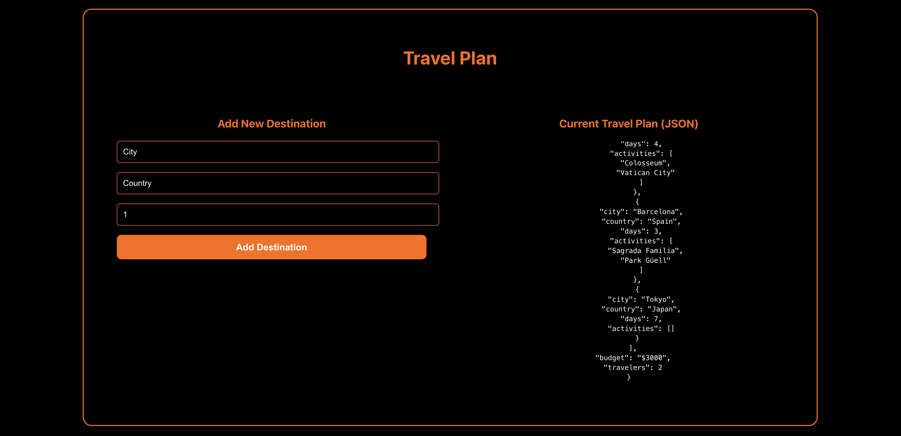
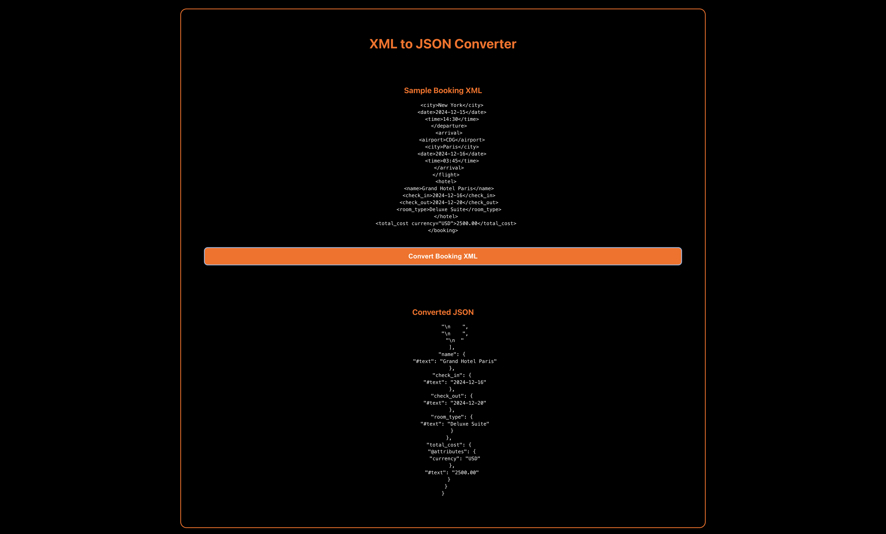

# PES2UG24CS421 : Smart Travel Companion Dashboard

**Name:** Sabique Islam  
**SRN:** PES2UG24CS421  
**Section:** G  
**Semester:** 3  

## Source Code

### 1. Main Application (App.jsx)

```jsx
import { useState } from 'react'
import './App.css'
import Welcome from './components/Welcome'
import Location from './components/Location'
import Weather from './components/Weather'
import TravelPlan from './components/TravelPlan'
import XMLtoJSON from './components/XMLtoJSON'

function App() {
  const [coordinates, setCoordinates] = useState({ latitude: null, longitude: null });

  const handleLocationFetched = (coords) => {
    setCoordinates(coords);
  };

  return (
    <>
      <Welcome />
      <div className="location-weather-container">
        <Location onLocationFetched={handleLocationFetched} />
        <Weather latitude={coordinates.latitude} longitude={coordinates.longitude} />
      </div>
      <TravelPlan />
      <XMLtoJSON />
    </>
  )
}

export default App
```

### 2. App.css

```css
#root {
  max-width: 1280px;
  margin: 0 auto;
  padding: 2rem;
  text-align: center;
}

.location-weather-container {
  display: grid;
  grid-template-columns: 1fr 1fr;
  gap: 2rem;
  max-width: 800px;
  margin: 2rem auto;
  align-items: start;
}

@media (max-width: 768px) {
  .location-weather-container {
    grid-template-columns: 1fr;
    gap: 1rem;
  }
}
```

### 3. Welcome Component (Welcome.jsx)

```jsx
import React from 'react'
import './Welcome.css'

function Welcome() {
  return (
    <div className="welcome-container">
      <div className="welcome-header">
        <h2>Welcome to Our Travel App</h2>
        <p>Discover amazing destinations and create unforgettable memories</p>
      </div>
      
      <div className="video-bento-grid">
        <div className="video-large">
          <video 
            autoPlay 
            muted 
            loop 
            className="destination-video"
            src="/video/dest1.mp4"
          />
          <div className="video-overlay">
            <h3>Destination 1</h3>
            <p>Explore breathtaking landscapes</p>
          </div>
        </div>
        
        <div className="video-small-container">
          <div className="video-small">
            <video 
              autoPlay 
              muted 
              loop 
              className="destination-video"
              src="/video/dest2.mp4"
            />
            <div className="video-overlay">
              <h4>Destination 2</h4>
              <p>Urban adventures await</p>
            </div>
          </div>
          
          <div className="video-small">
            <video 
              autoPlay 
              muted 
              loop 
              className="destination-video"
              src="/video/dest3.mp4"
            />
            <div className="video-overlay">
              <h4>Destination 3</h4>
              <p>Tropical paradise found</p>
            </div>
          </div>
        </div>
      </div>
    </div>
  )
}

export default Welcome
```

### 4. Welcome.css

```css
.welcome-container {
  color: white;
  padding: 2rem;
}

.welcome-header {
  text-align: center;
  margin-bottom: 3rem;
}

.welcome-header h2 {
  font-size: 3rem;
  margin-bottom: 1rem;
  color: #ff6a00;
  font-weight: bold;
}

.welcome-header p {
  font-size: 1.2rem;
  color: #000000;
  max-width: 600px;
  margin: 0 auto;
  line-height: 1.6;
}

.video-bento-grid {
  display: grid;
  grid-template-columns: 2fr 1fr;
  gap: 1.5rem;
  max-width: 1400px;
  margin: 0 auto;
  height: 600px;
}

.video-large {
  position: relative;
  overflow: hidden;
  border-radius: 20px;
  border: 2px solid #ff6a00;
}

.video-small-container {
  display: grid;
  grid-template-rows: 1fr 1fr;
  gap: 1.5rem;
}

.video-small {
  position: relative;
  overflow: hidden;
  border-radius: 15px;
  border: 1px solid #ff6a00;
}

.destination-video {
  width: 100%;
  height: 100%;
  object-fit: cover;
}

.video-large .destination-video {
  height: 600px;
}

.video-small .destination-video {
  height: 100%;
  min-height: 285px;
}

.video-overlay {
  position: absolute;
  bottom: 0;
  left: 0;
  right: 0;
  background: linear-gradient(transparent, rgba(0, 0, 0, 0.8));
  padding: 2rem;
}

.video-large .video-overlay {
  padding: 3rem;
}

.video-small .video-overlay {
  padding: 1.5rem;
}

.video-overlay h3 {
  font-size: 2rem;
  margin-bottom: 0.5rem;
  color: #ff6a00;
  font-weight: bold;
}

.video-overlay h4 {
  font-size: 1.5rem;
  margin-bottom: 0.5rem;
  color: #ff6a00;
  font-weight: bold;
}

.video-overlay p {
  font-size: 1.1rem;
  color: white;
  line-height: 1.4;
  margin: 0;
}

.video-small .video-overlay p {
  font-size: 1rem;
}

/* Responsive Design */
@media (max-width: 1200px) {
  .video-bento-grid {
    max-width: 1000px;
    height: 500px;
  }
  
  .video-large .destination-video {
    height: 500px;
  }
  
  .video-small .destination-video {
    min-height: 235px;
  }
}

@media (max-width: 768px) {
  .welcome-container {
    padding: 1rem;
  }
  
  .welcome-header h2 {
    font-size: 2.5rem;
  }
  
  .video-bento-grid {
    grid-template-columns: 1fr;
    grid-template-rows: 1fr auto auto;
    height: auto;
    gap: 1rem;
  }
  
  .video-small-container {
    grid-template-columns: 1fr 1fr;
    grid-template-rows: 1fr;
    gap: 1rem;
  }
  
  .video-large .destination-video {
    height: 300px;
  }
  
  .video-small .destination-video {
    min-height: 200px;
  }
  
  .video-overlay h3 {
    font-size: 1.5rem;
  }
  
  .video-overlay h4 {
    font-size: 1.2rem;
  }
  
  .video-overlay p {
    font-size: 0.9rem;
  }
}

@media (max-width: 480px) {
  .video-small-container {
    grid-template-columns: 1fr;
    grid-template-rows: 1fr 1fr;
  }
  
  .welcome-header h2 {
    font-size: 2rem;
  }
  
  .welcome-header p {
    font-size: 1rem;
  }
}
```


### 5. Location Component (Location.jsx)

```jsx
import React, { useState } from "react";
import "./Location.css";

const Location = ({ onLocationFetched }) => {
  const [coords, setCoords] = useState({ latitude: null, longitude: null });
  const [isLoading, setIsLoading] = useState(false);

  const fetchLocation = () => {
    setIsLoading(true);
    navigator.geolocation.getCurrentPosition((position) => {
      const { latitude, longitude } = position.coords;
      setCoords({ latitude, longitude });
      setIsLoading(false);
      if (onLocationFetched) {
        onLocationFetched({ latitude, longitude });
      }
    });
  };

  return (
    <div className="location-card">
      <h2 className="location-title">Get Your Location</h2>
      <button 
        className="location-btn" 
        onClick={fetchLocation}
        disabled={isLoading}
      >
        {isLoading ? 'Getting Location...' : 'Fetch Location'}
      </button>
      {coords.latitude && coords.longitude && (
        <p className="location-coords">
          Latitude: {coords.latitude.toFixed(4)} <br />
          Longitude: {coords.longitude.toFixed(4)}
        </p>
      )}
    </div>
  );
};

export default Location;
```

### 6. Location.css

```css
.location-card {
  background-color: #000;
  color: #fff;
  padding: 20px;
  border-radius: 10px;
  width: 100%;
  max-width: 350px;
  border: 2px solid #ff6a00;
  text-align: center;
  margin: 0 auto;
}

.location-title {
  color: #ff6a00;
  margin-bottom: 20px;
  font-size: 20px;
}

.location-btn {
  background-color: #ff6a00;
  color: white;
  border: none;
  padding: 12px 24px;
  border-radius: 8px;
  font-size: 16px;
  font-weight: bold;
  cursor: pointer;
  margin-bottom: 20px;
}

.location-btn:disabled {
  background-color: #000000;
  cursor: not-allowed;
}

.location-coords {
  color: #fff;
  font-size: 16px;
  text-align: left;
}
```

### 7. Weather Component (Weather.jsx)

```jsx
import React, { useEffect, useState } from 'react';
import axios from 'axios';
import './Weather.css';

function Weather({ latitude, longitude }) {
  const [weather, setWeather] = useState(null);
  const [isLoading, setIsLoading] = useState(false);

  useEffect(() => {
    if (latitude && longitude) {
      fetchWeather();
    }
  }, [latitude, longitude]);

  const fetchWeather = async () => {
    setIsLoading(true);
    const response = await axios.get(`https://api.open-meteo.com/v1/forecast?latitude=${latitude}&longitude=${longitude}&current=temperature_2m,relative_humidity_2m,wind_speed_10m,weather_code&timezone=auto`);
    setWeather(response.data.current);
    setIsLoading(false);
  };

  return (
    <div className="weather-card">
      <h2 className="weather-title">Current Weather</h2>
      {!latitude || !longitude ? (
        <p className="weather-message">Please fetch your location first</p>
      ) : isLoading ? (
        <p className="weather-message">Loading weather data...</p>
      ) : weather ? (
        <div className="weather-details">
          <div className="weather-item">
            <span className="weather-label">Temperature:</span>
            <span className="weather-value">{weather.temperature_2m}°C</span>
          </div>
          <div className="weather-item">
            <span className="weather-label">Humidity:</span>
            <span className="weather-value">{weather.relative_humidity_2m}%</span>
          </div>
          <div className="weather-item">
            <span className="weather-label">Wind Speed:</span>
            <span className="weather-value">{weather.wind_speed_10m} km/h</span>
          </div>
        </div>
      ) : null}
    </div>
  );
}

export default Weather;
```

### 8. Weather.css

```css
.weather-card {
  background: #000000;
  border: 2px solid #ff6a00;
  border-radius: 15px;
  padding: 2rem;
  color: white;
  width: 100%;
  max-width: 350px;
  margin: 0 auto;
  min-height: 200px;
}

.weather-title {
  color: #ff6a00;
  font-size: 1.8rem;
  margin-bottom: 1.5rem;
  text-align: center;
}

.weather-message {
  color: #000000;
  text-align: center;
  font-size: 1.1rem;
  margin: 2rem 0;
}

.weather-details {
  display: flex;
  flex-direction: column;
  gap: 1rem;
}

.weather-item {
  display: flex;
  justify-content: space-between;
  padding: 0.5rem 0;
  border-bottom: 1px solid #000000;
}

.weather-item:last-child {
  border-bottom: none;
}

.weather-label {
  color: white;
  font-weight: 500;
}

.weather-value {
  color: #ff6a00;
  font-weight: bold;
}
```


### 9. Travel Plan Component (TravelPlan.jsx)

```jsx
import React, { useState } from 'react';
import './TravelPlan.css';

function TravelPlan() {
  const [travelData, setTravelData] = useState({
    trip_name: "European Adventure",
    duration: "10 days",
    destinations: [
      { city: "Paris", country: "France", days: 3, activities: ["Eiffel Tower", "Louvre Museum"] },
      { city: "Rome", country: "Italy", days: 4, activities: ["Colosseum", "Vatican City"] },
      { city: "Barcelona", country: "Spain", days: 3, activities: ["Sagrada Familia", "Park Güell"] }
    ],
    budget: "$3000",
    travelers: 2
  });

  const [newDestination, setNewDestination] = useState({
    city: '',
    country: '',
    days: 1,
    activities: []
  });

  const addDestination = () => {
    if (newDestination.city && newDestination.country) {
      setTravelData(prev => ({
        ...prev,
        destinations: [...prev.destinations, { ...newDestination }]
      }));
      setNewDestination({ city: '', country: '', days: 1, activities: [] });
    }
  };

  return (
    <div className="travel-plan-container">
      <h2 className="travel-title">Travel Plan</h2>
      
      <div className="travel-content">
        <div className="add-destination">
          <h3>Add New Destination</h3>
          <input
            type="text"
            placeholder="City"
            value={newDestination.city}
            onChange={(e) => setNewDestination({...newDestination, city: e.target.value})}
          />
          <input
            type="text"
            placeholder="Country"
            value={newDestination.country}
            onChange={(e) => setNewDestination({...newDestination, country: e.target.value})}
          />
          <input
            type="number"
            placeholder="Days"
            value={newDestination.days}
            onChange={(e) => setNewDestination({...newDestination, days: parseInt(e.target.value)})}
          />
          <button className="add-btn" onClick={addDestination}>
            Add Destination
          </button>
        </div>

        <div className="json-display">
          <h3>Current Travel Plan (JSON)</h3>
          <pre className="json-content">
            {JSON.stringify(travelData, null, 2)}
          </pre>
        </div>
      </div>
    </div>
  );
}

export default TravelPlan;
```

### 10. TravelPlan.css

```css
.travel-plan-container {
  background: #000000;
  border: 2px solid #ff6a00;
  border-radius: 15px;
  padding: 2rem;
  color: white;
  max-width: 1200px;
  margin: 2rem auto;
}

.travel-title {
  color: #ff6a00;
  font-size: 2rem;
  margin-bottom: 2rem;
  text-align: center;
}

.travel-content {
  display: grid;
  grid-template-columns: 1fr 1fr;
  gap: 2rem;
}

.add-destination {
  background: #000000;
  padding: 1.5rem;
  border-radius: 10px;
  border: 1px solid #000000;
}

.add-destination h3 {
  color: #ff6a00;
  margin-bottom: 1rem;
}

.add-destination input {
  width: 100%;
  padding: 10px;
  margin-bottom: 1rem;
  background: #000;
  border: 1px solid #ff6a00;
  border-radius: 5px;
  color: white;
  font-size: 14px;
}

.add-destination input::placeholder {
  color: white;
}

.add-btn {
  background: #ff6a00;
  color: white;
  border: none;
  padding: 12px 24px;
  border-radius: 8px;
  font-size: 16px;
  font-weight: bold;
  cursor: pointer;
  width: 100%;
}

.json-display {
  background: #000000;
  padding: 1.5rem;
  border-radius: 10px;
  border: 1px solid #000000;
}

.json-display h3 {
  color: #ff6a00;
  margin-bottom: 1rem;
}

.json-content {
  background: #000;
  color: white;
  padding: 1rem;
  border-radius: 5px;
  border: 1px solid #000000;
  overflow-x: auto;
  font-size: 12px;
  line-height: 1.4;
  white-space: pre-wrap;
}

@media (max-width: 768px) {
  .travel-content {
    grid-template-columns: 1fr;
  }
}
```



### 11. XML to JSON Component (XMLtoJSON.jsx)

```jsx
import React, { useState } from 'react';
import './XMLtoJSON.css';

function XMLtoJSON() {
  const [jsonResult, setJsonResult] = useState(null);

  const sampleXML = `<?xml version="1.0" encoding="UTF-8"?>
<booking>
  <booking_id>BK123456</booking_id>
  <customer>
    <name>John Doe</name>
    <email>john.doe@email.com</email>
    <phone>+1-555-0123</phone>
  </customer>
  <flight>
    <airline>SkyLine Airways</airline>
    <flight_number>SL789</flight_number>
    <departure>
      <airport>JFK</airport>
      <city>New York</city>
      <date>2024-12-15</date>
      <time>14:30</time>
    </departure>
    <arrival>
      <airport>CDG</airport>
      <city>Paris</city>
      <date>2024-12-16</date>
      <time>03:45</time>
    </arrival>
  </flight>
  <hotel>
    <name>Grand Hotel Paris</name>
    <check_in>2024-12-16</check_in>
    <check_out>2024-12-20</check_out>
    <room_type>Deluxe Suite</room_type>
  </hotel>
  <total_cost currency="USD">2500.00</total_cost>
</booking>`;

  const convertXMLtoJSON = () => {
    const parser = new DOMParser();
    const xmlDoc = parser.parseFromString(sampleXML, "text/xml");
    
    const xmlToJson = (xml) => {
      let obj = {};
      
      if (xml.nodeType === 1) {
        if (xml.attributes.length > 0) {
          obj["@attributes"] = {};
          for (let j = 0; j < xml.attributes.length; j++) {
            const attribute = xml.attributes.item(j);
            obj["@attributes"][attribute.nodeName] = attribute.nodeValue;
          }
        }
      } else if (xml.nodeType === 3) {
        obj = xml.nodeValue;
      }
      
      if (xml.hasChildNodes()) {
        for (let i = 0; i < xml.childNodes.length; i++) {
          const item = xml.childNodes.item(i);
          const nodeName = item.nodeName;
          
          if (typeof obj[nodeName] === "undefined") {
            obj[nodeName] = xmlToJson(item);
          } else {
            if (typeof obj[nodeName].push === "undefined") {
              const old = obj[nodeName];
              obj[nodeName] = [];
              obj[nodeName].push(old);
            }
            obj[nodeName].push(xmlToJson(item));
          }
        }
      }
      return obj;
    };
    
    const result = xmlToJson(xmlDoc);
    setJsonResult(result);
  };

  return (
    <div className="xml-json-container">
      <h2 className="xml-title">XML to JSON Converter</h2>
      
      <div className="converter-content">
        <div className="xml-section">
          <h3>Sample Booking XML</h3>
          <pre className="xml-content">{sampleXML}</pre>
          <button className="convert-btn" onClick={convertXMLtoJSON}>
            Convert Booking XML
          </button>
        </div>

        {jsonResult && (
          <div className="json-section">
            <h3>Converted JSON</h3>
            <pre className="json-content">
              {JSON.stringify(jsonResult, null, 2)}
            </pre>
          </div>
        )}
      </div>
    </div>
  );
}

export default XMLtoJSON;
```

### 12. XMLtoJSON.css

```css
.xml-json-container {
  background: #000000;
  border: 2px solid #ff6a00;
  border-radius: 15px;
  padding: 2rem;
  color: white;
  max-width: 1200px;
  margin: 2rem auto;
}

.xml-title {
  color: #ff6a00;
  font-size: 2rem;
  margin-bottom: 2rem;
  text-align: center;
}

.converter-content {
  display: grid;
  grid-template-columns: 1fr;
  gap: 2rem;
}

.xml-section {
  background: #000000;
  padding: 1.5rem;
  border-radius: 10px;
  border: 1px solid #000000;
}

.xml-section h3 {
  color: #ff6a00;
  margin-bottom: 1rem;
}

.xml-content {
  background: #000;
  color: white;
  padding: 1rem;
  border-radius: 5px;
  border: 1px solid #000000;
  overflow-x: auto;
  font-size: 12px;
  line-height: 1.4;
  white-space: pre-wrap;
  margin-bottom: 1rem;
  max-height: 300px;
  overflow-y: auto;
}

.convert-btn {
  background: #ff6a00;
  color: white;
  border: none;
  padding: 12px 24px;
  border-radius: 8px;
  font-size: 16px;
  font-weight: bold;
  cursor: pointer;
  width: 100%;
}

.json-section {
  background: #000000;
  padding: 1.5rem;
  border-radius: 10px;
  border: 1px solid #000000;
}

.json-section h3 {
  color: #ff6a00;
  margin-bottom: 1rem;
}

.json-content {
  background: #000;
  color: white;
  padding: 1rem;
  border-radius: 5px;
  border: 1px solid #000000;
  overflow-x: auto;
  font-size: 12px;
  line-height: 1.4;
  white-space: pre-wrap;
  max-height: 400px;
  overflow-y: auto;
}
```



### 13. Entry Point (main.jsx)

```jsx
import React from 'react'
import ReactDOM from 'react-dom/client'
import App from './App.jsx'
import './index.css'

ReactDOM.createRoot(document.getElementById('root')).render(
  <React.StrictMode>
    <App />
  </React.StrictMode>,
)
```

### 14. Global Styles (index.css)

```css
:root {
  font-family: system-ui, Avenir, Helvetica, Arial, sans-serif;
  line-height: 1.5;
  font-weight: 400;

  color-scheme: light dark;
  color: rgb(255, 255, 255);
  background-color: #000000;

  font-synthesis: none;
  text-rendering: optimizeLegibility;
  -webkit-font-smoothing: antialiased;
  -moz-osx-font-smoothing: grayscale;
}

body {
  margin: 0;
  display: flex;
  place-items: center;
}
```