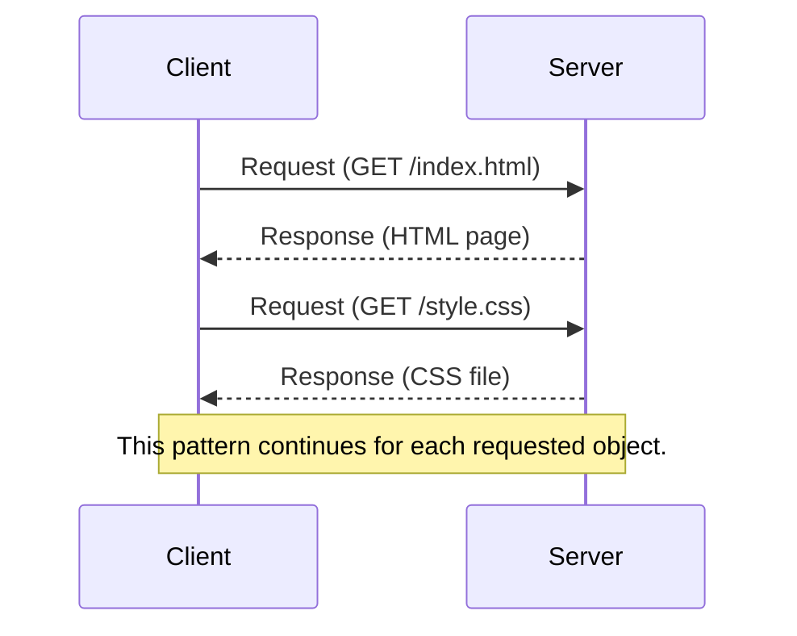
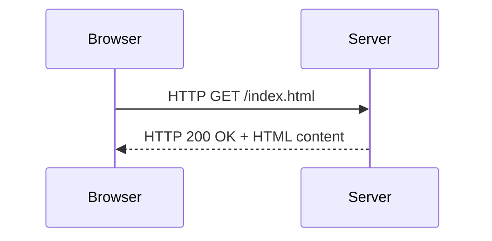
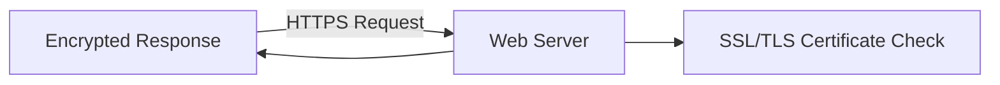

---

# **Introduction to WWW, Web Protocols and URLs**

## 1. Internet vs. World Wide Web (WWW)

| Concept      | Internet                                               | World Wide Web (WWW)                           |
| ------------ | ------------------------------------------------------ | ---------------------------------------------- |
| Definition   | The physical and logical global network infrastructure | A service using the internet to access content |
| Protocols    | TCP/IP, UDP, FTP, etc.                                 | HTTP, HTTPS                                    |
| Services     | Email, VoIP, gaming, file transfer                     | Accessing documents via browsers               |
| Architecture | Device-to-device networking                            | Client-server based data exchange              |
| Analogy      | Road system                                            | Vehicles (browsers) on that road               |

---

## 2. How the WWW Works

WWW operates on a **client/server architecture** and follows a **request/response** communication pattern.



---

## 3. History of Web Browsers

| Year | Browser           | Type      | Notes                                      |
| ---- | ----------------- | --------- | ------------------------------------------ |
| 1991 | Lynx              | Text-only | Early, no graphical capability             |
| 1993 | Mosaic            | Graphical | First to support embedded images           |
| 1994 | Netscape          | Graphical | Popular before Internet Explorer           |
| 1995 | Internet Explorer | Graphical | Bundled with Windows                       |
| 2004 | Firefox           | Graphical | Customizable and open source               |
| 2008 | Chrome            | Graphical | Focused on speed and simplicity            |
| 2020 | Edge (Chromium)   | Graphical | Modern Microsoft browser based on Chromium |

---

## 4. URL – Uniform Resource Locator

A **URL** uniquely identifies a resource on the web.

**General structure**:

```plaintext
scheme://domain/path
```

**Example**:
`https://www.amazon.com/international-sales-offers.html`

| Part   | Description                                               |
| ------ | --------------------------------------------------------- |
| scheme | Protocol (e.g., http, https)                              |
| domain | Host name (e.g., [www.amazon.com](http://www.amazon.com)) |
| path   | Resource location on the server                           |

---

## 5. Web Servers

Web servers store and serve web content.

| Component       | Purpose                                            |
| --------------- | -------------------------------------------------- |
| Server Root     | Contains server software and configuration files   |
| Document Root   | Public directory serving content (HTML, CSS, etc.) |
| Popular Servers | Apache, IIS, NGINX                                 |

**Note**: Clients cannot directly access the server root. Requests are mapped to document root based on server config.

---

## 6. DNS – Domain Name System

DNS translates human-readable domain names into machine-usable IP addresses.

```mermaid
graph TD;
    A[User Types URL] --> B[DNS Resolver];
    B --> C[Root Server];
    C --> D[TLD Server (.com)];
    D --> E[Authoritative Server (e.g., google.com)];
    E --> F[Returns IP Address];
    F --> G[Browser connects using IP];
```

**Process**:

1. OS queries DNS resolver.
2. Resolver makes iterative queries to:

   * Root server
   * TLD server
   * Authoritative server
3. IP is returned, browser connects to the web server.

---

## 7. Setting Up a Website

| Step | Description                                  |
| ---- | -------------------------------------------- |
| 1    | Choose and register a domain                 |
| 2    | Subscribe to a hosting service               |
| 3    | Install CMS (e.g., WordPress) or custom code |
| 4    | Configure layout, theme, and structure       |
| 5    | Add pages and media content                  |

---

## 8. Protocols

A **protocol** is a defined set of rules for data communication.

| Protocol | Function                                |
| -------- | --------------------------------------- |
| HTTP     | Standard protocol for web communication |
| HTTPS    | Secure HTTP using SSL/TLS               |
| FTP      | File transfer between hosts             |
| SMTP     | Email transmission                      |

---

## 9. HTTP – HyperText Transfer Protocol

**Model**:

* HTTP operates on a **client/server** basis.
* Default port: 80 (HTTPS uses 443)
* Stateless: Server does not retain client session history



---

## 10. Persistent vs. Non-Persistent HTTP

| Type           | Description                                   |
| -------------- | --------------------------------------------- |
| Non-persistent | One object per TCP connection                 |
| Persistent     | Multiple objects over a single TCP connection |

---

## 11. HTTP Request Format

```plaintext
<Method> <Resource URI> <HTTP Version>
Headers
[Blank line]
[Optional message body]
```

**Example**:

```http
GET /index.html HTTP/1.1
Host: example.com
User-Agent: Mozilla/5.0
Connection: keep-alive
```

| Field   | Description                    |
| ------- | ------------------------------ |
| Method  | HTTP method (e.g., GET, POST)  |
| URI     | Path of the resource requested |
| Version | HTTP/1.0 or HTTP/1.1           |
| Headers | Metadata about request         |
| Body    | Optional (mainly in POST/PUT)  |

---

## 12. HTTP Methods

| Method  | Use Case                          |
| ------- | --------------------------------- |
| GET     | Request data (no side effects)    |
| POST    | Submit data (e.g., forms)         |
| PUT     | Upload/replace a file             |
| DELETE  | Remove a resource                 |
| HEAD    | Fetch headers only                |
| OPTIONS | Get server-supported capabilities |

---

## 13. HTTP Response Format

```plaintext
<Version> <Status Code> <Status Message>
Headers
[Blank line]
[Response Body]
```

**Example**:

```http
HTTP/1.1 200 OK
Content-Type: text/html
Content-Length: 127

<html>
  <body>Welcome</body>
</html>
```

| Field       | Description                               |
| ----------- | ----------------------------------------- |
| Status Line | Version, status code, message             |
| Headers     | Metadata about the response               |
| Body        | Requested content (HTML, CSS, JSON, etc.) |

---

## 14. HTTP Status Codes

| Code | Category      | Description                          |
| ---- | ------------- | ------------------------------------ |
| 1xx  | Informational | Request received, continuing process |
| 2xx  | Success       | Request was successful               |
| 3xx  | Redirection   | Further action required              |
| 4xx  | Client Error  | Problem with request                 |
| 5xx  | Server Error  | Problem with server                  |

**Common Codes**:

* 200 OK: Success
* 301 Moved Permanently: Resource has a new URI
* 403 Forbidden: Access denied
* 404 Not Found: Resource unavailable
* 500 Internal Server Error: Server malfunction

---

## 15. HTTPS – Secure HTTP

| Feature        | Function                                  |
| -------------- | ----------------------------------------- |
| Encryption     | Protects data during transmission         |
| Authentication | Confirms server identity via certificates |
| Integrity      | Prevents data tampering                   |



**Notes**:

* HTTPS uses SSL/TLS encryption.
* Runs on port 443.
* Important for e-commerce, login pages, and user data privacy.


---
